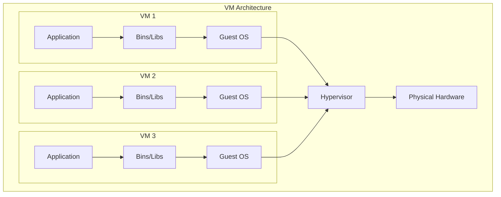
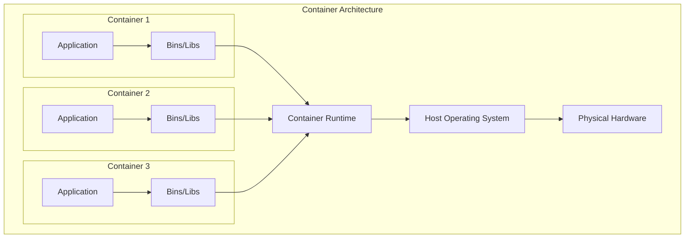
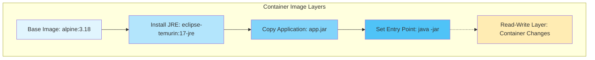

# Container vs Virtual Machine Architecture

## Virtual Machine Architecture

## Container Architecture

## Comparison Table

| Aspect | Virtual Machines | Containers |
|--------|------------------|------------|
| Isolation | Hardware-level | OS-level |
| Size | GBs (includes OS) | MBs (no OS) |
| Boot Time | Minutes | Seconds |
| Resource Overhead | High | Low |
| OS Support | Any OS | Host kernel only |
| Security | Stronger isolation | Process isolation |

## Container Image Layers

