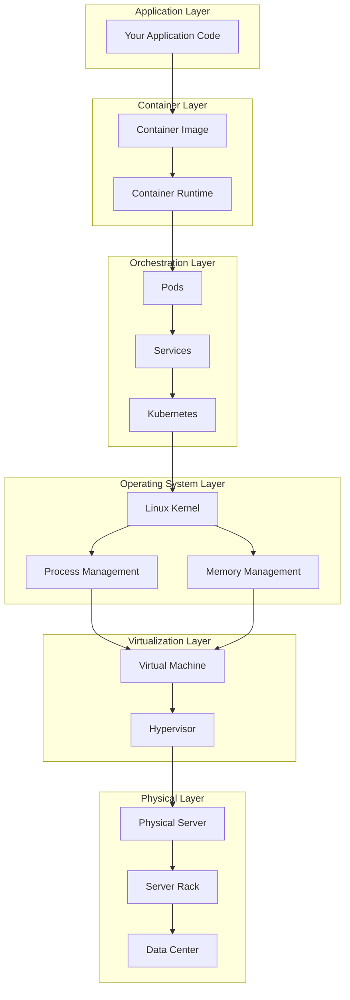
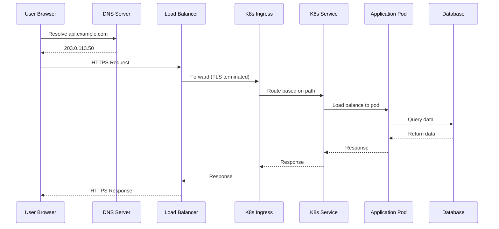
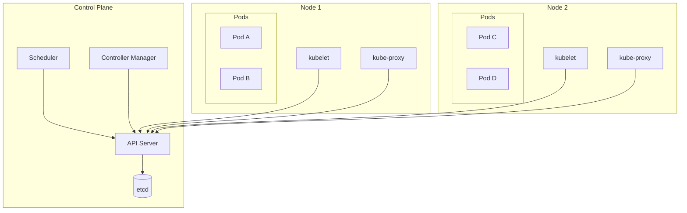

# Infrastructure Stack Diagram

This diagram shows how the layers of infrastructure stack on top of each other.

```mermaid
graph TB
    subgraph "Application Layer"
        APP[Your Application Code]
    end

    subgraph "Container Layer"
        CONT[Container Runtime]
        IMG[Container Image]
    end

    subgraph "Orchestration Layer"
        K8S[Kubernetes]
        SVC[Services]
        POD[Pods]
    end

    subgraph "Operating System Layer"
        KERNEL[Linux Kernel]
        PROC[Process Management]
        MEM[Memory Management]
    end

    subgraph "Virtualization Layer"
        VM[Virtual Machine]
        HYP[Hypervisor]
    end

    subgraph "Physical Layer"
        SERVER[Physical Server]
        RACK[Server Rack]
        DC[Data Center]
    end

    APP --> IMG
    IMG --> CONT
    CONT --> POD
    POD --> SVC
    SVC --> K8S
    K8S --> KERNEL
    KERNEL --> PROC
    KERNEL --> MEM
    PROC --> VM
    MEM --> VM
    VM --> HYP
    HYP --> SERVER
    SERVER --> RACK
    RACK --> DC
```

## Alternative View: Request Flow

```mermaid
sequenceDiagram
    participant U as User Browser
    participant DNS as DNS Server
    participant LB as Load Balancer
    participant ING as K8s Ingress
    participant SVC as K8s Service
    participant POD as Application Pod
    participant DB as Database

    U->>DNS: Resolve api.example.com
    DNS-->>U: 203.0.113.50

    U->>LB: HTTPS Request
    LB->>ING: Forward (TLS terminated)
    ING->>SVC: Route based on path
    SVC->>POD: Load balance to pod
    POD->>DB: Query data
    DB-->>POD: Return data
    POD-->>SVC: Response
    SVC-->>ING: Response
    ING-->>LB: Response
    LB-->>U: HTTPS Response
```

## Kubernetes Architecture

```mermaid
graph TB
    subgraph "Control Plane"
        API[API Server]
        SCHED[Scheduler]
        CM[Controller Manager]
        ETCD[(etcd)]
    end

    subgraph "Node 1"
        KUB1[kubelet]
        PROXY1[kube-proxy]
        subgraph "Pods"
            P1A[Pod A]
            P1B[Pod B]
        end
    end

    subgraph "Node 2"
        KUB2[kubelet]
        PROXY2[kube-proxy]
        subgraph "Pods "
            P2A[Pod C]
            P2B[Pod D]
        end
    end

    API --> ETCD
    SCHED --> API
    CM --> API
    KUB1 --> API
    KUB2 --> API
    PROXY1 --> API
    PROXY2 --> API
```
