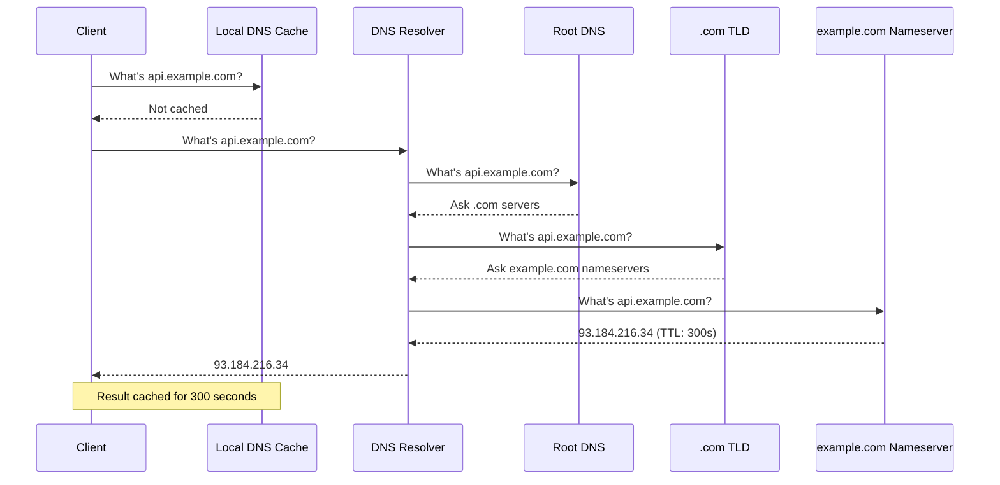
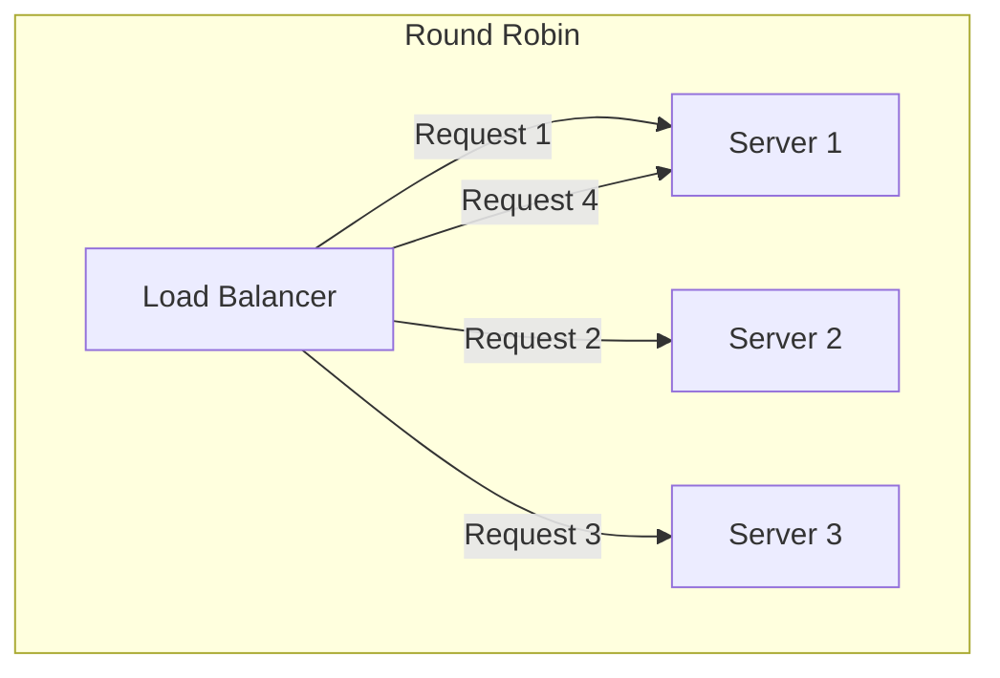
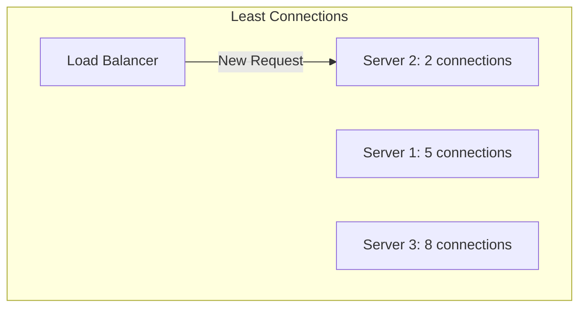
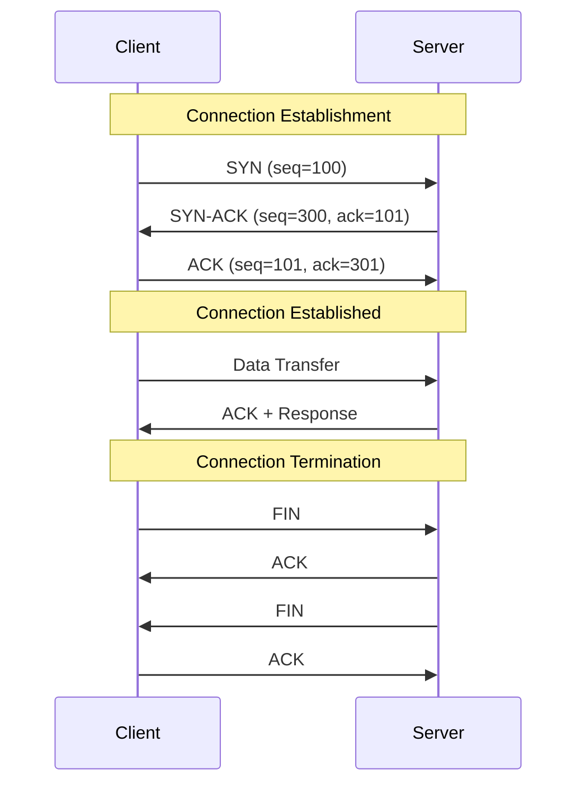
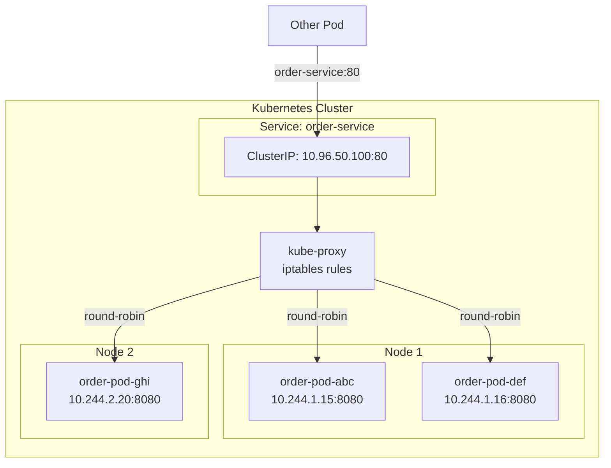

# Networking Diagrams

## DNS Resolution Flow



## Load Balancer Patterns





## Port Mapping

```
┌──────────────────────────────────────────────────────────────┐
│                        Host Machine                           │
│                     Public IP: 203.0.113.50                  │
│                                                              │
│  Port 80 ──────────────────────┬─────────────────────────┐  │
│  Port 443 ─────────────────────┼──────────────────────┐  │  │
│  Port 8080 ────────────────────┼───────────────────┐  │  │  │
│                                │                   │  │  │  │
│  ┌─────────────────────────────┼───────────────────┼──┼──┼──┤
│  │         Docker Engine       │                   │  │  │  │
│  │                             │                   │  │  │  │
│  │  ┌─────────────────────┐    │    ┌────────────────────┐  │
│  │  │    Container A      │◄───┘    │    Container B     │  │
│  │  │    (nginx)          │         │    (api)           │  │
│  │  │    Port 80 ─────────┼─────────►    Port 8080       │  │
│  │  └─────────────────────┘         └────────────────────┘  │
│  │                                                          │
│  │  ┌─────────────────────┐                                 │
│  │  │    Container C      │◄────────── Port 443            │
│  │  │    (https-proxy)    │                                 │
│  │  │    Port 443         │                                 │
│  │  └─────────────────────┘                                 │
│  └──────────────────────────────────────────────────────────┤
└──────────────────────────────────────────────────────────────┘

External Access:
  http://203.0.113.50:80     → Container A (nginx)
  https://203.0.113.50:443   → Container C (https-proxy)
  http://203.0.113.50:8080   → Container B (api)
```

## TCP Three-Way Handshake



## Kubernetes Service Networking


